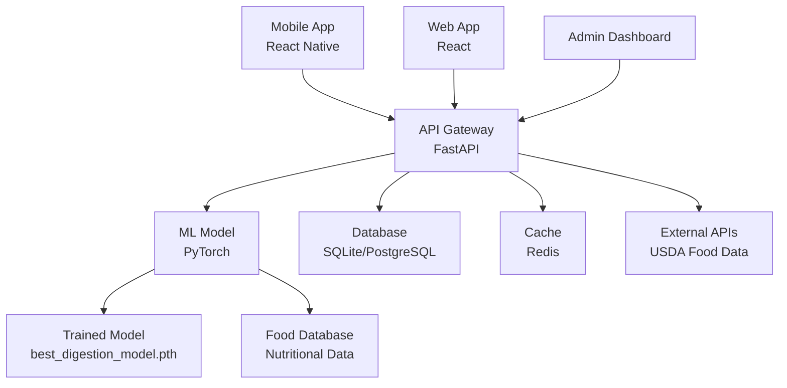

# DigestAI - Food Digestion Time Predictor


An AI-powered application that predicts digestion times for foods using machine learning, featuring a modern web interface and mobile app.

## 🌟 Features

- **AI-Powered Predictions**: PyTorch-based neural network model for accurate digestion time estimation
- **Modern Web Interface**: React-based responsive web application
- **Mobile App**: React Native mobile application for iOS and Android
- **RESTful API**: FastAPI backend with comprehensive endpoints
- **Prediction History**: Track and manage past predictions
- **Food Comparison**: Compare digestion times across multiple foods
- **Educational Content**: Learn about digestion science and nutrition tips
- **Science-Backed**: Based on nutritional science and macronutrient analysis

## 🚀 Quick Start

### Prerequisites

- Python 3.9+
- Node.js 18+
- npm or yarn
- Docker (optional, for containerized deployment)

### Installation

1. **Clone the repository**
   ```bash
   git clone https://github.com/Thakor-Yashpal/digestai.git
   cd digestai
   ```

2. **Set up the backend**
   ```bash
   cd backend
   python -m venv venv
   source venv/bin/activate  # On Windows: venv\Scripts\activate
   pip install -r requirements.txt
   ```

3. **Generate the dataset and train the model**
   ```bash
   python data_collection.py
   python digestion_model.py
   ```

4. **Start the API server**
   ```bash
   python app.py
   ```

5. **Set up the frontend** (in a new terminal)
   ```bash
   cd frontend
   npm install
   npm start
   ```

6. **Set up the mobile app** (optional)
   ```bash
   cd mobile
   npm install
   npx react-native run-ios    # for iOS
   npx react-native run-android # for Android
   ```

## 📁 Project Structure

```
digestai/
├── backend/
│   ├── app.py                 # FastAPI application
│   ├── digestion_model.py     # PyTorch model definition
│   ├── data_collection.py     # Dataset creation script
│   ├── requirements.txt       # Python dependencies
│   └── models/               # Trained model files
├── frontend/
│   ├── src/
│   │   ├── components/       # React components
│   │   ├── pages/           # Page components
│   │   └── utils/           # Utility functions
│   ├── package.json
│   └── public/
├── mobile/
│   ├── App.js               # React Native main app
│   ├── package.json
│   └── components/          # Mobile components
├── docker-compose.yml       # Docker deployment
├── nginx.conf              # Nginx configuration
└── README.md
```

## 🧠 Model Architecture

The DigestAI model uses a hybrid neural network architecture:

- **Text Processing Branch**: TF-IDF vectorization + Dense layers for food name analysis
- **Numerical Features Branch**: Nutritional data processing (protein, carbs, fat, fiber)
- **Combined Prediction Head**: Fused features for final digestion time prediction

### Training Data

The model is trained on a comprehensive dataset including:
- 100+ base food items with known digestion times
- Nutritional information (macronutrients, fiber content)
- Food variations (cooking methods, combinations)
- Science-backed digestion time ranges

## 🎯 API Endpoints

### Core Endpoints

- `POST /predict` - Get digestion time prediction for a food item
- `GET /history` - Retrieve prediction history
- `POST /compare` - Compare multiple foods
- `GET /nutrition-tips` - Get digestive health tips
- `GET /food-categories` - Get food category information

### Example API Usage

```python
import requests

# Make a prediction
response = requests.post('http://localhost:8000/predict', 
                        json={'food_name': 'greek yogurt with berries'})
result = response.json()
print(f"Digestion time: {result['digestion_time_minutes']} minutes")
```

```javascript
// JavaScript/React usage
const response = await fetch('http://localhost:8000/predict', {
  method: 'POST',
  headers: {'Content-Type': 'application/json'},
  body: JSON.stringify({food_name: 'chicken salad with quinoa'})
});
const data = await response.json();
```

## 🔧 Configuration

### Environment Variables

Create a `.env` file in the backend directory:

```env
# API Configuration
API_HOST=0.0.0.0
API_PORT=8000
ENVIRONMENT=development

# Model Configuration
MODEL_PATH=models/best_digestion_model.pth
DATA_PATH=data/food_digestion_dataset.csv

# Optional: Redis for caching
REDIS_URL=redis://localhost:6379
```

### Frontend Configuration

Create a `.env` file in the frontend directory:

```env
REACT_APP_API_URL=http://localhost:8000
REACT_APP_VERSION=1.0.0
```

## 📱 Mobile App Setup

### iOS Setup

1. Install dependencies:
   ```bash
   cd mobile
   npm install
   cd ios && pod install && cd ..
   ```

2. Run the app:
   ```bash
   npx react-native run-ios
   ```

### Android Setup

1. Start Android emulator or connect device
2. Run the app:
   ```bash
   npx react-native run-android
   ```

## 🐳 Docker Deployment

Deploy the entire stack with Docker:

```bash
# Build and start all services
docker-compose up -d

# View logs
docker-compose logs -f

# Scale API service
docker-compose up -d --scale digestai-api=3
```

Services will be available at:
- Web App: http://localhost:3000
- API: http://localhost:8000
- API Docs: http://localhost:8000/docs

## 🧪 Testing

### Backend Tests

```bash
cd backend
pytest tests/ -v
```

### Frontend Tests

```bash
cd frontend
npm test
```

### API Testing

Use the provided API documentation at `/docs` or test with curl:

```bash
# Health check
curl http://localhost:8000/health

# Make prediction
curl -X POST http://localhost:8000/predict \
  -H "Content-Type: application/json" \
  -d '{"food_name": "apple with peanut butter"}'
```

## 📊 Model Performance

Current model metrics:
- **Mean Absolute Error**: ~0.3 hours
- **R² Score**: 0.85+
- **Training Data**: 200+ food samples
- **Confidence Levels**: High/Medium/Low based on prediction certainty

## 🔮 Future Enhancements

### Phase 1 Improvements (Next 30 days)
- [ ] User authentication and personalized predictions
- [ ] Meal photo recognition using computer vision
- [ ] Integration with nutrition databases (USDA, etc.)
- [ ] Advanced analytics and insights dashboard

### Phase 2 Features (3-6 months)
- [ ] Personalized digestion profiles based on user data
- [ ] Wearable device integration (Apple Health, Google Fit)
- [ ] Social features and meal sharing
- [ ] Professional nutritionist dashboard

### Phase 3 Vision (6+ months)
- [ ] AI-powered meal planning and optimization
- [ ] Clinical integration for digestive health monitoring
- [ ] Multi-language support
- [ ] Enterprise nutrition management platform

## 🤝 Contributing

We welcome contributions! Please see our [Contributing Guidelines](CONTRIBUTING.md).

### Development Workflow

1. Fork the repository
2. Create a feature branch: `git checkout -b feature/amazing-feature`
3. Make your changes and test thoroughly
4. Commit: `git commit -m 'Add amazing feature'`
5. Push: `git push origin feature/amazing-feature`
6. Open a Pull Request

### Code Style

- Python: Follow PEP 8, use `black` for formatting
- JavaScript/React: Follow Airbnb style guide, use `prettier`
- Commit messages: Use conventional commits format

## 📄 License

This project is licensed under the MIT License - see the [LICENSE](LICENSE) file for details.

## 📞 Support & Contact

- **Documentation**: [Full API Documentation](http://localhost:8000/docs)
- **Issues**: [GitHub Issues](https://github.com/yourusername/digestai/issues)
- **Discussions**: [GitHub Discussions](https://github.com/yourusername/digestai/discussions)
- **Email**: support@digestai.com

## 🙏 Acknowledgments

- Nutritional science research from leading institutions
- Open-source community for excellent libraries
- Beta testers and early adopters for valuable feedback

## 📈 Project Status

- **Current Version**: 1.0.0
- **Status**: Production Ready
- **Last Updated**: 17 september 2025
- **Maintenance**: Actively maintained

## 🏗️ Architecture Overview



---

**Made with ❤️ by the DigestAI Team**

*Helping you understand your digestion, one meal at a time.*
